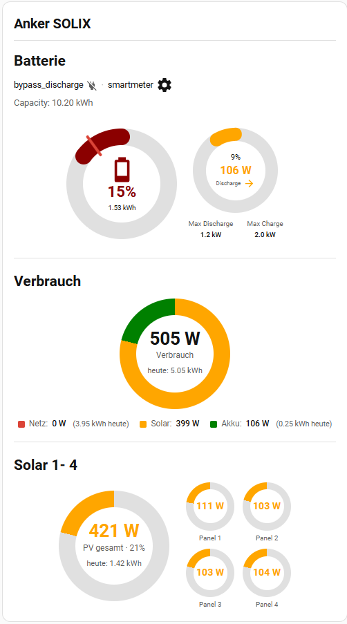

# Energy Gauge Card

[](https://my.home-assistant.io/redirect/hacs_repository/?owner=GB-1972&repository=HA-Energy-Gauge-Card&category=plugin)

A Home Assistant Lovelace card with **battery**, **consumption**, and **solar** gauges — each section optional, all sensors freely configurable.



Forked from [Universal Battery Card](https://github.com/laurence-syree/universal-battery-card) (MIT) by Laurence Syree, itself based on [givtcp-battery-card](https://github.com/Codegnosis/givtcp-battery-card) by Codegnosis.

## Features

- **Multilingual UI**: English, German, French, Spanish — auto-detected from HA's language, or forced via `language` option
- **Three independent sections** (`show_battery`, `show_consumption`, `show_solar`) — combine any subset in one card
- **Battery section** (inherited from UBC): SOC ring + Power ring, reserve/cutoff markers, time-to-full/empty estimates, stats panel for temp/cycles/health, 5-step SOC color thresholds
- **Consumption section**: 3-segment donut (Grid / PV-direct / Battery-discharge) with the total wattage in the center; legend with current power + today's energy per source
- **Solar section**: one large total-PV gauge plus one gauge per string (arbitrary count), each with its own Wp peak driving the gauge fill
- **Three consumption calc modes** to match whatever sensors your inverter exposes
- **Visual editor** with tabs for each area and a dynamic panel list with add/remove buttons
- Entity-specific clicks open the more-info dialog

## Installation

### HACS (recommended)

1. In Home Assistant, open **HACS** → **Frontend** → ⋮ menu → **Custom repositories**
2. Add the repository URL with category **Dashboard**
3. Search for "Energy Gauge Card" in HACS and install
4. HACS usually registers the Lovelace resource automatically. If not, add it manually under
   **Settings → Dashboards → Resources**:
   ```yaml
   url: /hacsfiles/HA-Energy-Gauge-Card/energy-gauge-card.js
   type: module
   ```
5. Hard-reload your browser (Ctrl+F5) after install

### Manual

1. Copy `energy-gauge-card.js` to `config/www/energy-gauge-card.js`
2. Add the Lovelace resource:
   ```yaml
   url: /local/energy-gauge-card.js
   type: module
   ```

## Quick Start — Minimal Configurations

### Battery only (drop-in for Universal Battery Card)

```yaml
type: custom:energy-gauge-card
name: Home Battery
show_battery: true
soc_entity: sensor.battery_soc
power_entity: sensor.battery_power
```

### Battery + Consumption (composed mode)

```yaml
type: custom:energy-gauge-card
name: Energy
show_battery: true
show_consumption: true
soc_entity: sensor.battery_soc
power_entity: sensor.battery_power
consumption_calc_mode: composed
grid_import_entity: sensor.grid_import_power
pv_direct_entity: sensor.pv_self_consumption_power
battery_discharge_entity: sensor.battery_discharge_to_house
consumption_energy_today_entity: sensor.house_consumption_today
grid_energy_today_entity: sensor.grid_import_today
pv_self_energy_today_entity: sensor.pv_self_consumption_today
battery_discharge_energy_today_entity: sensor.battery_discharge_today
```

### Full card: Battery + Consumption + Solar (4 strings)

```yaml
type: custom:energy-gauge-card
name: Energy
show_battery: true
show_consumption: true
show_solar: true

# --- Battery
soc_entity: sensor.battery_soc
power_entity: sensor.battery_power
capacity: 10.0
reserve: 10

# --- Consumption (calculated mode)
consumption_calc_mode: calculated
consumption_entity: sensor.house_consumption_power
grid_power_entity: sensor.grid_power           # signed: +import / -export
grid_invert: false
# battery_consumption_invert: false            # flip if your power_entity uses the opposite sign convention
consumption_energy_today_entity: sensor.house_consumption_today
grid_energy_today_entity: sensor.grid_import_today

# --- Solar
pv_total_entity: sensor.pv_total_power
pv_total_energy_today_entity: sensor.pv_production_today
pv_panels:
  - entity: sensor.pv_string_1_power
    name: "Ost"
    peak: 400
    energy_today_entity: sensor.pv_string_1_today
  - entity: sensor.pv_string_2_power
    name: "Süd-Ost"
    peak: 400
    energy_today_entity: sensor.pv_string_2_today
  - entity: sensor.pv_string_3_power
    name: "Süd-West"
    peak: 400
    energy_today_entity: sensor.pv_string_3_today
  - entity: sensor.pv_string_4_power
    name: "West"
    peak: 400
    energy_today_entity: sensor.pv_string_4_today
```

## Language

The card auto-detects the active Home Assistant UI language and uses it for all labels (gauge captions, state words like *Charging / Laden / Charge / Cargando*, legend entries, etc.). Supported: **English, Deutsch, Français, Español**.

To override:

```yaml
language: de   # or: en | fr | es | auto (default)
```

The visual editor itself stays in English.

## Section Toggles

| Option | Default | Description |
|---|---|---|
| `show_battery` | `true` | Render battery section (SOC + Power gauges) |
| `show_consumption` | `false` | Render consumption donut |
| `show_solar` | `false` | Render total-PV gauge + per-panel gauges |

## Battery Section

See the [Universal Battery Card README](https://github.com/laurence-syree/universal-battery-card#configuration) for the full list — all original options are preserved.

Required when `show_battery: true`:

| Option | Description |
|---|---|
| `soc_entity` | State of charge sensor (%) |
| `power_entity` | Battery power sensor (W). Positive = charging, negative = discharging |

## Consumption Section

The donut splits the current household consumption into three slices: **Grid import**, **PV self-consumption**, and **Battery discharge to house**. Pick the calculation mode that matches the sensors your inverter / energy meter exposes.

### Calculation modes

| Mode | Required sensors |
|---|---|
| `composed` (default) | `grid_import_entity`, `pv_direct_entity`, `battery_discharge_entity` — three positive-only sensors. Total = sum. |
| `calculated` | `consumption_entity`, `grid_power_entity` (signed), `power_entity` (battery, signed). PV-direct = total − grid − battery. |
| `direct` | `consumption_entity`, `pv_self_consumption_entity`, `power_entity` (battery, signed). Grid = total − PV − battery. |

### All consumption options

| Option | Description |
|---|---|
| `consumption_calc_mode` | `composed` / `calculated` / `direct` |
| `consumption_entity` | Total consumption (W) — needed for calculated/direct |
| `grid_import_entity` | Grid import (W, ≥0) — composed mode |
| `pv_direct_entity` | PV consumed directly (W, ≥0) — composed mode |
| `battery_discharge_entity` | Battery → house (W, ≥0) — composed mode |
| `grid_power_entity` | Grid power signed — calculated mode |
| `grid_invert` | Flip sign convention for grid_power_entity |
| `battery_consumption_invert` | Flip sign for the battery power source (in addition to `invert_power`) |
| `pv_self_consumption_entity` | PV self-consumption (W) — direct mode |
| `consumption_energy_today_entity` | Today's total consumption (kWh) |
| `grid_energy_today_entity` | Today's grid import (kWh) |
| `pv_self_energy_today_entity` | Today's PV self-consumption (kWh) |
| `battery_discharge_energy_today_entity` | Today's battery discharge (kWh) |
| `show_consumption_legend` | Show colored legend below the donut (default `true`) |
| `show_consumption_energy_today` | Show today's totals in center + legend (default `true`) |
| `consumption_color_grid` | RGB `[r,g,b]` for grid segment |
| `consumption_color_pv` | RGB for PV segment |
| `consumption_color_battery` | RGB for battery segment |

## Solar Section

One total-PV gauge (optional) plus one gauge per string. Each panel is a row in `pv_panels`:

```yaml
pv_panels:
  - entity: sensor.pv_string_1_power      # required
    name: "Ost"                            # optional label
    peak: 400                              # Wp, drives the 100% fill mark
    energy_today_entity: sensor.pv_s1_today  # optional, shown below gauge
```

### All solar options

| Option | Description |
|---|---|
| `pv_total_entity` | Total PV power (W). If omitted, the total gauge is hidden |
| `pv_total_peak` | System peak (Wp) for the total gauge. If omitted, sum of panel peaks is used |
| `pv_total_energy_today_entity` | Today's total PV production (kWh) |
| `pv_panels` | Array of `{ entity, name?, peak, energy_today_entity? }` |
| `show_solar_energy_today` | Show today's energy in gauge centers (default `true`) |
| `solar_color` | RGB color for solar gauge fill |

## Visual Editor

Click "Edit" on the card to open the tabbed editor:

- **General** — card name, gauge thickness, header style, display toggles
- **Sections** — enable battery / consumption / solar
- **Battery** — battery entities and fixed values
- **Stats** — temperature, cycles, health
- **Consumption** — calc mode + all consumption entities + colors
- **Solar** — total PV entity + peak + dynamic panel list (add / remove buttons)
- **SOC Colors** — battery threshold colors
- **Filters** — trickle charge filter

## License

MIT — see [LICENSE](LICENSE). Original UBC and givtcp-battery-card attributions preserved.
